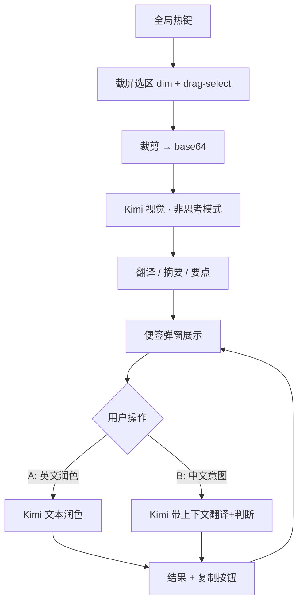

# Architecture — said-wat

> **Purpose:** Stack, flows, and API facts for building said-wat.
> **Status:** Current
> **Verified against:** Alignment interview + Kimi API docs (platform.kimi.ai), 2026-08-09
> **Primary code:** not yet created — greenfield

## Stack

- Electron 35 + TypeScript (strict, ES2024, ESM) + React 19, rspack bundling, oxlint/eslint, vitest — mirroring Multi-Code (`docs/knowledge/tech-conventions.md`).
- Single LLM provider: Kimi (Moonshot), OpenAI-compatible.
- Zero native dependencies; tray-resident; global hotkeys.

## LLM integration

- Base URL: `https://api.moonshot.cn/v1` (Chinese platform — verified live 2026-08-10; the builder's key does NOT authenticate against `api.moonshot.ai`). Official `openai` Node SDK.
- API key: env var `MOONSHOT_API_KEY` (or repo-root `.env` in dev); never in repo, never hardcoded.
- v1 default model: `kimi-k2.6` in non-thinking mode (vision + text, thinking switchable).
- Fallback: `kimi-k2.7-code` (builder's "Kimi 2.7") — thinking always on; reserved for hard screenshot interpretation.
- Vision input: `content` array with `type: "image_url"` + base64 data URL (png/jpeg/webp/gif; keep ≤4K).
- Image tokens count dynamically by resolution — hundreds to low thousands per screenshot; output/thinking tokens dominate cost, so thinking stays off.

## Flows

### Part 1 — screenshot interpret

1. Global hotkey → screen-capture overlay (WeChat desktop UX clone: dim + drag-select; Electron fullscreen overlay + `desktopCapturer`, requires Screen Recording permission).
2. Crop region → base64 → Kimi (vision, non-thinking) with a 3-section output prompt: full translation (untranslatable parts kept as-is) / one-line summary / notable points.
3. Result rendered in a sticky-note popup (always-on-top, frameless, compact).

### Part 2 — reply workspace (same note)

- Multi-line draft box below the analysis.
- **Flow A:** user writes English → copies → polish hotkey → Kimi (text) → idiomatic English. Pure text polish, no context check.
- **Flow B:** user writes Chinese intent → send → Kimi with context = note analysis + full accumulated conversation → judge whether the screenshot's questions are answered → translate to English; if not answered, translate anyway + append a warning line. Result + copy button.
- Multi-turn: every send includes the note's conversation history.

## Config & storage

- Hotkeys configurable (placeholders Cmd+W / Cmd+E conflict with universal close-window — 3-key combos recommended).
- Config persisted under the user config dir (mirror Multi-Code `settings-store.ts` pattern, `~/.config/<app>/…`).
